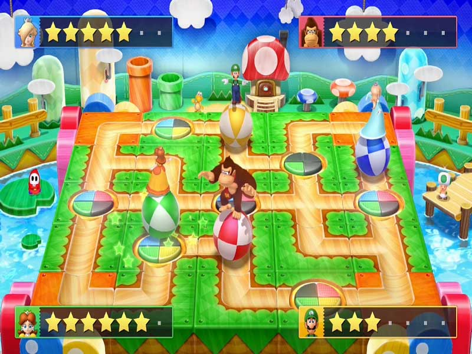

# Trabajo Práctico del Taller de Programación Avanzada

## Introducción
Durante el taller desarrollaremos un juego de tipo tablero que contiene minijuegos, muy similar al [Mario Party](https://en.wikipedia.org/wiki/Mario_Party) o al [Pummel Party](https://store.steampowered.com/app/880940/Pummel_Party/).

En las clases del taller se les proveerá de herramientas para poder realizarlo en Java, con las buenas prácticas que irán adquiriendo.

### Metodología de trabajo

La realización del juego, tendrá cuatro etapas con sus respectivas entregas:

| Fecha | Contenido de la entrega                                                                                        |
|-------|----------------------------------------------------------------------------------------------------------------|
| 28/09 | Diagrama de clases del modelo del juego, implementado y testeado (código)                                      |
| 19/10 | Posibilidad de interactuar con los elementos del juego en tiempo real en un entorno simulado, de forma gráfica |
| 09/11 | Capacidad de ser jugado a través de cliente-servidor                                                           |
| 30/11 | Requisitos extra acordados                                                                                     |

> Se espera que las prácticas de programación sean buenas, y adecuadas al conocimiento adquirido en la materia.
> Esto incluye evitar el código aglomerado, tener una buena interacción de clases, no duplicar funcionalidades, tener el código indentado y prolijo, entre otras.

---

## Mecánica del juego

La mecánica del juego consiste en un tablero, el cual los jugadores pueden recorrer e interactuar, y al final de cada ronda los jugadores competirán en un minijuego.
* Una partida debe contar como mínimo con 2 jugadores (y soportar más de 4)
* Una partida debe contar con múltiples rondas.
* En cada ronda, un jugador por vez realiza su turno, y se repetirá por cada jugador hasta que todos lo hayan realizado. Luego de esto, se inicia un minijuego.
* La partida finaliza cuando un jugador haya llegado a un objetivo claro definido (por ejemplo, una cierta cantidad de puntaje, recursos -como monedas-, o recurrer N veces el tablero)
* La partida se jugará en un tablero con casillas determinadas. Cada una de las casillas podrá tener alguna propiedad o algún efecto en particular.
* El tablero deberá contar con multiples caminos. Al llegar a una unión, el jugador podrá elegir por que parte del camino continúa.
* El turno de un jugador comienza tirando un dado, y avanzando esa cantidad de casillas en el tablero. Luego de esto, comienza la etapa de acciones del jugador.
* La etapa de acciones del jugador tiene un tiempo límite. Durante ese tiempo el jugador tiene la capacidad de ejecutar acciones.
* Las acciones que puede ejecutar el jugador son utilizar objectos, activar algún poder especial, o cualquier cosa que desee. Mientras más entretenido, claro y dinámico, mejor.
* Al finalizar el turno de cada jugador, se iniciará un minijuego.
* Antes de iniciar el minijuego, se deberá explicar al usuario la modalidad de juego, las condiciones de victoria, los controles, y todo lo que consideren necesario.
* El final del minijuego debe estar determinado por un límite de tiempo. También puede tener otras condiciones de finalización propias de cada minijuego.
* Al final del minijuego se debe mostrar una tabla de resultados según los resultados del minijuego. Se debe recompensar de alguna manera a los ganadores y/o castigar a los perdedores.
* La posición inicial de los jugadores puede ser estática o dinámica, juntos o separados. El único requerimiento es que ningún jugador tenga una ventaja o desventaja significativa por la posición que inicia.

## Objetivos

Se espera que el equipo desarrolle los menúes de opción, el tablero, y al menos **un minijuego**. Los mismos se repetirán luego de N rondas.  
Sin embargo, el desarrollo debe estar adaptado para poder extenderlo mediante la incorporación de nuevos minijuegos. Dicho punto se considerará esencial para el proyecto.

## Requisitos esenciales

1. Como usuario quiero ingresar al juego con mi nombre de usuario y contraseña, para poder jugar contra otros jugadores en una sala
2. Como usuario quiero seleccionar una sala de las existentes, para poder ingresar y jugar con los participantes (*1)
3. Como usuario quiero crear nuevas salas para que ingresen otros jugadores (*2)
4. Como usuario quiero poder salir de una sala, incluso si en la misma el juego se encuentra en ejecución
5. Como usuario quiero poder identificar cada jugador (saber quién lo maneja, y ver su puntaje)

Notas:
> (*1) Una sala puede estar activa para que ingresen jugadores mientras un juego no esté activo en la misma. Aún así, debe aparecer en la lista de juegos como que el juego ya inició

> (*2) La partida podrá ser iniciada por el creador de la sala, o cuando todos los jugadores estén listos, o cualquier otra condición que consideren

## Requisitos opcionales

1. Como usuario quiero crear salas privadas, en las cuales solo pueden ingresar los usuarios que deseo *(esto se puede hacer, por ejemplo, a través de contraseñas, o salas que sólo se pueda ingresar con invitación)*
2. Como usuario quiero poder utilizar un joystick (todo lo necesario para que funcione debe estar en código propio java [no mapear joystick a teclas por ejemplo])
3. Como usuario quiero poder jugar una partida de un solo jugar contra la AI, sin necesidad de ingresar usuario, ni crear salas
4. Como usuario quiero enviar reacciones o mensajes predeterminados durante la partida
5. Como usuario quiero poder configurar el tablero al momento de crear la sala (largo, estilo, etc)
6. Como usuario quiero configurar los controles de mi personaje
7. Como usuario quiero ver mi historial de partidas con sus detalles *(puntos, cantidad de obstáculos eliminados, asesinatos, muertes, etc; de cada bomberman)*
8. Como usuario quiero ingresar a una partida, pero no participar, sino solo ver la partida, como un espectador, pudiendo ingresar y salir de la misma en cualquier momento
9. Como usuario quiero poder pausar el juego mientras estamos en el tablero, sea o no mi turno. Cualquiero otro jugador debe poder sacar la pausa.
10. Como usuario quiero disfrutar de buenos efectos de sonido y música mientras juego.
11. Como usuario quiero jugar un segundo minijuego.
12. Como usuario quiero jugar un tercer minijuego.

> Aceptamos sugerencias de requisitos opcionales
